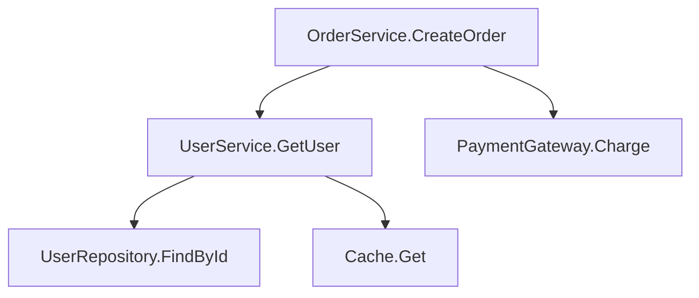
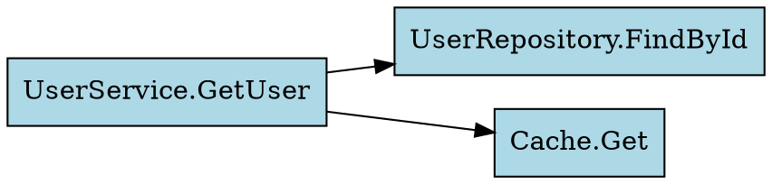

# .NET 어셈블리 호출 관계 분석 & 시각화

IL 수준에서 메서드 호출(Call, Callvirt, Newobj) 명령어를 추적하여 호출 관계 그래프를 생성하고, 다양한 형식으로 시각화한다.

## 사전 요건

- .NET 8 SDK
- 공통 프로젝트: `dotnet-analyze` 스킬의 `scripts/setup-project.sh` 실행

## 출력 형식

### 1. Mermaid 다이어그램 (기본)

웹 브라우저에서 바로 렌더링할 수 있다. [mermaid.live](https://mermaid.live)에 붙여넣기.



### 2. Graphviz DOT

PNG/SVG 이미지로 변환 가능. `dot -Tpng graph.dot -o graph.png`



### 3. 콘솔 테이블

가장 많이 호출되는/호출하는 메서드를 테이블로 정리.

## 분석 로직

IL 명령어에서 호출 관계를 추출하는 핵심 코드:

```csharp
using dnlib.DotNet;
using dnlib.DotNet.Emit;

var graph = new Dictionary<string, (List<string> Calls, List<string> CalledBy)>();

foreach (var type in module.GetTypes())
{
    if (type.IsGlobalModuleType || type.Name.StartsWith("<")) continue;

    // 네임스페이스 필터 (선택)
    if (nsFilter != null && !type.Namespace?.Contains(nsFilter) == true)
        continue;

    foreach (var method in type.Methods.Where(m => m.HasBody))
    {
        string caller = $"{type.Name}.{method.Name}";
        EnsureNode(graph, caller);

        foreach (var instr in method.Body.Instructions)
        {
            if (instr.OpCode != OpCodes.Call &&
                instr.OpCode != OpCodes.Callvirt &&
                instr.OpCode != OpCodes.Newobj) continue;

            if (instr.Operand is not IMethodDefOrRef calledMethod) continue;

            string callee = $"{calledMethod.DeclaringType?.Name ?? "?"}.{calledMethod.Name}";
            EnsureNode(graph, callee);

            // 양방향 기록
            if (!graph[caller].Calls.Contains(callee))
                graph[caller].Calls.Add(callee);
            if (!graph[callee].CalledBy.Contains(caller))
                graph[callee].CalledBy.Add(caller);
        }
    }
}
```

## 시각화 생성 코드

상세 구현은 `references/callgraph-template.cs`를 참조한다.

### Mermaid 생성

```csharp
var sb = new StringBuilder();
sb.AppendLine("graph TD");

var topNodes = graph.OrderByDescending(n => n.Value.CalledBy.Count + n.Value.Calls.Count)
    .Take(maxNodes);

foreach (var (name, edges) in topNodes)
{
    foreach (var called in edges.Calls)
    {
        string fromId = SafeId(name);
        string toId = SafeId(called);
        sb.AppendLine($"    {fromId}[\"{name}\"] --> {toId}[\"{called}\"]");
    }
}
```

### DOT 생성

```csharp
sb.AppendLine("digraph CallGraph {");
sb.AppendLine("    rankdir=LR;");
sb.AppendLine("    node [shape=box, style=filled, fillcolor=lightblue, fontname=\"Consolas\"];");

// 핫 노드 강조 (5회 이상 호출)
foreach (var (name, edges) in topNodes.Where(n => n.Value.CalledBy.Count >= 5))
    sb.AppendLine($"    \"{name}\" [fillcolor=orange];");

foreach (var (name, edges) in topNodes)
    foreach (var called in edges.Calls)
        sb.AppendLine($"    \"{name}\" -> \"{called}\";");

sb.AppendLine("}");
```

## 분석 인사이트

호출 그래프에서 다음을 자동으로 식별한다:

| 패턴 | 의미 | 표시 |
|------|------|------|
| **Hub 노드** (호출받는 수 ≥ 5) | 핵심 유틸리티/서비스 | 주황색 |
| **God 메서드** (호출하는 수 ≥ 10) | 리팩토링 후보 | 테이블에서 별표 |
| **고립 노드** (호출 0, 피호출 0) | 데드코드 또는 엔트리포인트 | 회색 |
| **순환 참조** (A→B→A) | 잠재적 문제 | 감지 시 경고 |

## 필터링 옵션

```bash
# 특정 네임스페이스만
dotnet run -- target.dll --namespace "MyApp.Services"

# 노드 수 제한
dotnet run -- target.dll --max-nodes 100

# .NET Framework 내부 호출 제외 (기본)
# System.*, Microsoft.* 네임스페이스는 기본적으로 제외
```

## 사용 시나리오

1. **레거시 코드 이해**: 어떤 메서드가 어디서 호출되는지 빠르게 파악
2. **리팩토링 영향 분석**: 특정 메서드를 변경하면 어디에 영향이 가는지 확인
3. **아키텍처 검증**: 레이어 간 의존성이 설계 의도와 일치하는지 검증
4. **데드코드 탐지**: 어디서도 호출되지 않는 메서드 식별

## 주의사항

- 리플렉션, 동적 호출(DynamicInvoke), 이벤트 구독은 정적 분석으로 추적 불가
- 제네릭 메서드는 인스턴스화된 타입 정보가 손실될 수 있다
- 대규모 어셈블리는 노드 수를 제한하여 가독성을 확보한다
