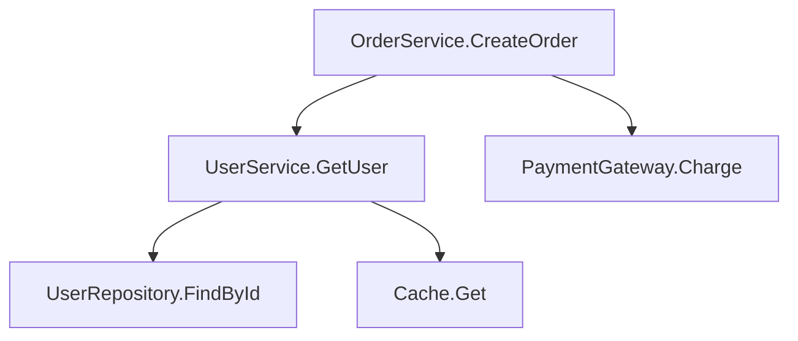
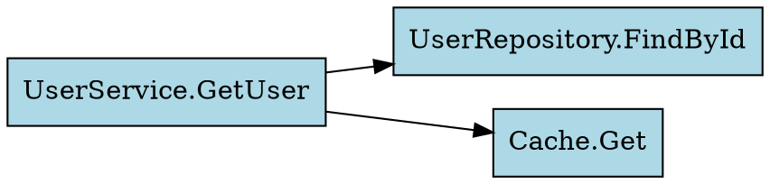

# .NET Assembly Call Graph Analysis & Visualization

Traces method call (Call, Callvirt, Newobj) instructions at the IL level to generate call relationship graphs and visualize them in various formats.

## Prerequisites

- .NET 8 SDK
- Shared project: Run `scripts/setup-project.sh` from the `dotnet-analyze` skill

## Output Formats

### 1. Mermaid Diagram (Default)

Can be rendered directly in a web browser. Paste into [mermaid.live](https://mermaid.live).



### 2. Graphviz DOT

Convertible to PNG/SVG images. `dot -Tpng graph.dot -o graph.png`



### 3. Console Table

Summarizes the most called/calling methods in a table.

## Analysis Logic

Core code for extracting call relationships from IL instructions:

```csharp
using dnlib.DotNet;
using dnlib.DotNet.Emit;

var graph = new Dictionary<string, (List<string> Calls, List<string> CalledBy)>();

foreach (var type in module.GetTypes())
{
    if (type.IsGlobalModuleType || type.Name.StartsWith("<")) continue;

    // Namespace filter (optional)
    if (nsFilter != null && !type.Namespace?.Contains(nsFilter) == true)
        continue;

    foreach (var method in type.Methods.Where(m => m.HasBody))
    {
        string caller = $"{type.Name}.{method.Name}";
        EnsureNode(graph, caller);

        foreach (var instr in method.Body.Instructions)
        {
            if (instr.OpCode != OpCodes.Call &&
                instr.OpCode != OpCodes.Callvirt &&
                instr.OpCode != OpCodes.Newobj) continue;

            if (instr.Operand is not IMethodDefOrRef calledMethod) continue;

            string callee = $"{calledMethod.DeclaringType?.Name ?? "?"}.{calledMethod.Name}";
            EnsureNode(graph, callee);

            // Bidirectional recording
            if (!graph[caller].Calls.Contains(callee))
                graph[caller].Calls.Add(callee);
            if (!graph[callee].CalledBy.Contains(caller))
                graph[callee].CalledBy.Add(caller);
        }
    }
}
```

## Visualization Generation Code

See `references/callgraph-template.cs` for the detailed implementation.

### Mermaid Generation

```csharp
var sb = new StringBuilder();
sb.AppendLine("graph TD");

var topNodes = graph.OrderByDescending(n => n.Value.CalledBy.Count + n.Value.Calls.Count)
    .Take(maxNodes);

foreach (var (name, edges) in topNodes)
{
    foreach (var called in edges.Calls)
    {
        string fromId = SafeId(name);
        string toId = SafeId(called);
        sb.AppendLine($"    {fromId}[\"{name}\"] --> {toId}[\"{called}\"]");
    }
}
```

### DOT Generation

```csharp
sb.AppendLine("digraph CallGraph {");
sb.AppendLine("    rankdir=LR;");
sb.AppendLine("    node [shape=box, style=filled, fillcolor=lightblue, fontname=\"Consolas\"];");

// Highlight hot nodes (called 5+ times)
foreach (var (name, edges) in topNodes.Where(n => n.Value.CalledBy.Count >= 5))
    sb.AppendLine($"    \"{name}\" [fillcolor=orange];");

foreach (var (name, edges) in topNodes)
    foreach (var called in edges.Calls)
        sb.AppendLine($"    \"{name}\" -> \"{called}\";");

sb.AppendLine("}");
```

## Analysis Insights

The following patterns are automatically identified from the call graph:

| Pattern | Meaning | Display |
|---------|---------|---------|
| **Hub node** (called by ≥ 5) | Core utility/service | Orange |
| **God method** (calls ≥ 10) | Refactoring candidate | Starred in table |
| **Isolated node** (calls 0, called by 0) | Dead code or entry point | Gray |
| **Circular reference** (A→B→A) | Potential issue | Warning when detected |

## Filtering Options

```bash
# Specific namespace only
dotnet run -- target.dll --namespace "MyApp.Services"

# Limit node count
dotnet run -- target.dll --max-nodes 100

# Exclude .NET Framework internal calls (default)
# System.*, Microsoft.* namespaces are excluded by default
```

## Use Cases

1. **Legacy code understanding**: Quickly identify where methods are called from
2. **Refactoring impact analysis**: Determine what is affected when changing a specific method
3. **Architecture validation**: Verify that inter-layer dependencies match design intent
4. **Dead code detection**: Identify methods that are never called from anywhere

## Notes

- Reflection, dynamic invocation (DynamicInvoke), and event subscriptions cannot be tracked through static analysis
- Generic methods may lose instantiated type information
- Limit the node count for large assemblies to ensure readability
